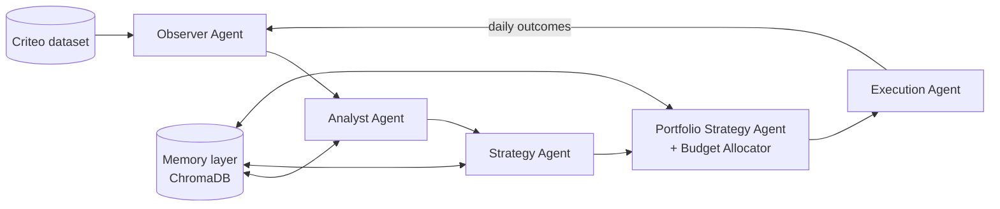

# Agentic AI for Autonomous Digital Marketing Campaign Management

A multi-agent LLM system that observes campaign performance, diagnoses problems, proposes strategy, and executes budget and bid decisions without a human in the loop. It is evaluated through a **30-day retrospective simulation** on public advertising benchmark data.

This repository contains the source code for my MSc Data Science thesis (upGrad × Liverpool John Moores University, 2026):

> *Agentic AI for Autonomous Digital Marketing Campaign Management: A Retrospective Simulation Study Using Public Benchmark Datasets*

 
<!-- TODO: set the actual Python version and license -->

---

## Why this project

Paid media teams spend a large share of their week on repetitive loops: pull the numbers, spot what changed, decide what to do, adjust budgets and bids, and repeat. This project asks whether a team of cooperating LLM agents can run that loop autonomously, and how its decisions compare against rule-based baselines and an oracle.

It draws on eight years of hands-on experience managing paid digital campaigns, and uses **public datasets only** (no proprietary client data).

---

## Architecture

The system is a pipeline of specialised agents, orchestrated with sequential Python calls, sharing a vector-based memory layer.



| Agent | Responsibility |
|---|---|
| **Observer** | Loads and validates raw data, builds daily campaign-level summaries |
| **Analyst** | Detects trends, anomalies and under/over-performing campaigns |
| **Strategy** | Proposes campaign-level actions (scale, hold, cut, rebid) with reasoning |
| **Portfolio Strategy + Allocator** | Balances budget across the whole campaign portfolio |
| **Execution** | Applies decisions to the simulated environment and logs outcomes |
| **Memory (ChromaDB)** | Stores past observations and decisions so agents can learn from earlier days |

**Design note:** LangGraph was evaluated but not adopted. Plain sequential orchestration kept the control flow transparent and easier to reproduce and test.

---

## Data

| Dataset | Role |
|---|---|
| **Criteo Attribution Modelling for Bidding** | Primary dataset for the 30-day simulation |
| **iPinYou RTB** | Secondary dataset, intended for benchmarking against RTBAgent (future work) |

Datasets are **not** included in this repo. Download them from their official sources and place them as follows:

```
data/
├── raw/          # original downloaded files
└── processed/    # generated by the Observer Agent (e.g. daily_campaign_summary.parquet)
```
<!-- TODO: add official download links and exact file names expected -->

---

## Getting started

```bash
git clone https://github.com/saikumarljmu-maker/agentic-marketing-ai.git
cd agentic-marketing-ai
python -m venv .venv
source .venv/bin/activate        # Windows: .venv\Scripts\activate
pip install -r requirements.txt
```

Set your API key (for Claude) in the environment:

```bash
export ANTHROPIC_API_KEY=your_key_here
```

For local models, install [Ollama](https://ollama.com) and pull the models you want to compare.

### Run the simulation

```bash
python main.py
```
<!-- TODO: document CLI flags, e.g. --days, --model, --dataset -->

### Reproduce the protect-off replay

```bash
python src/<replay_script>.py
```
<!-- TODO: replace with the actual script name and what it demonstrates -->

### Run tests

```bash
pytest tests/
```

---

## Evaluation

- **30-day retrospective simulation** on Criteo data, with Claude Sonnet 4.6 as the primary model
- **Oracle comparison:** agent decisions are compared against a true oracle with full hindsight
- **Baselines:** <!-- TODO: list rule-based / static-budget baselines -->
- **Reproducibility:** temperature = 0 for all LLM calls
- **7-model comparison:** Claude Sonnet 4.6 (API) vs. Qwen3, Gemma3, Llama 3.2, Mistral, DeepSeek-R1 and Phi-4 (local, via Ollama)

---

## Results

<!-- TODO: replace with your real numbers and a chart (e.g. results/figures/model_comparison.png) -->

| Model | Conversions | CPA | ROAS | Oracle gap |
|---|---|---|---|---|
| Claude Sonnet 4.6 | – | – | – | – |
| Qwen3 | – | – | – | – |
| ... | | | | |

**Key findings**
- <!-- TODO: 2–3 one-line takeaways, e.g. "Agent X closed Y% of the gap to the oracle" -->

---

## Project structure

```
agentic-marketing-ai/
├── main.py             # entry point: runs the full simulation
├── src/                # agents, memory layer, allocator, replay scripts
├── tests/              # unit and integration tests
├── requirements.txt
└── README.md
```

---

## Limitations and future work

- Retrospective simulation cannot capture real auction dynamics or competitor responses
- iPinYou / RTBAgent benchmarking not yet completed
- Future work: live A/B testing in a sandbox ad account, and a human-in-the-loop approval mode

---

## Citation

If you reference this work:

```
<Your Name> (2026). Agentic AI for Autonomous Digital Marketing Campaign Management:
A Retrospective Simulation Study Using Public Benchmark Datasets.
MSc Data Science thesis, Liverpool John Moores University.
```

Supervisor: Dr Anukriti Bansal

---

## Author

**<Your Name>**
[LinkedIn](https://linkedin.com/in/<your-handle>) · <your-personal-email>

## License

<!-- TODO: add a LICENSE file (MIT is a common choice) -->
